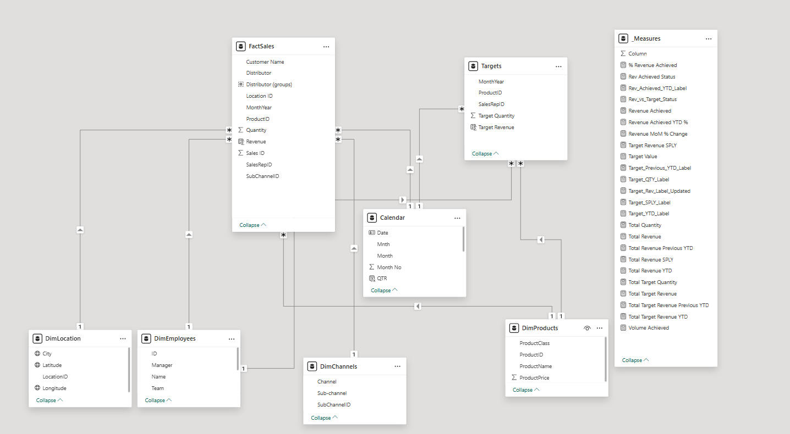
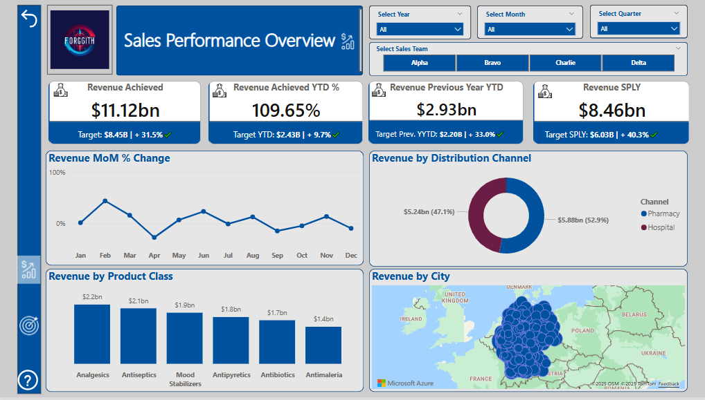
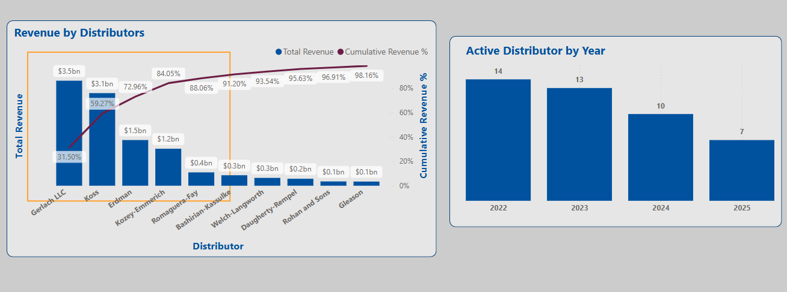
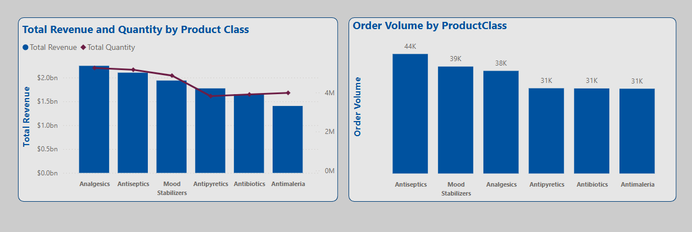
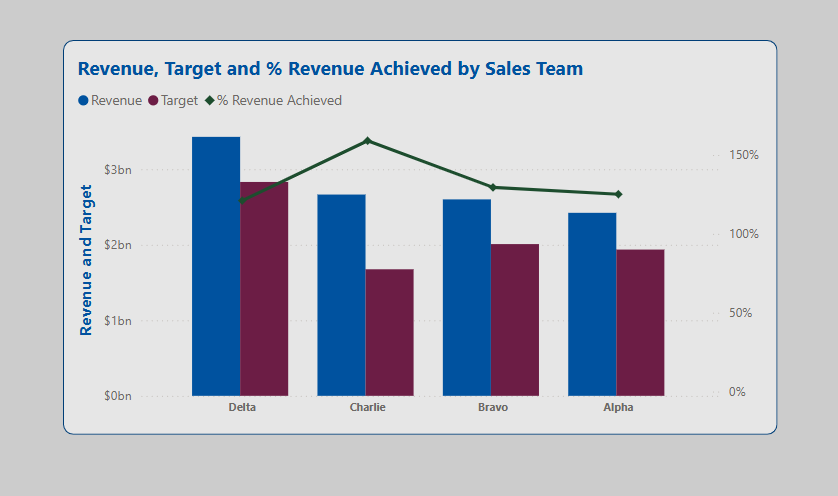
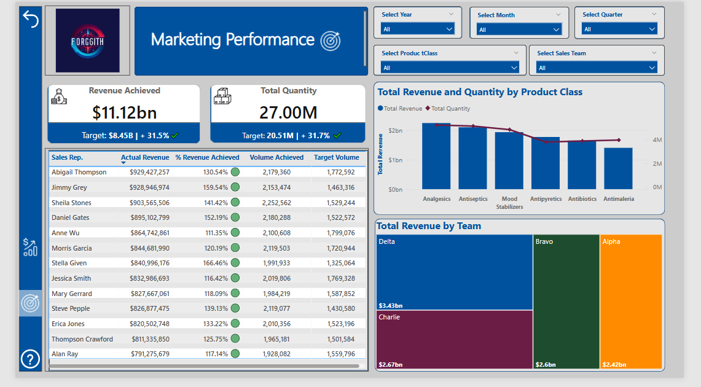

# Forggith BI Performance Tracker 📈

## Project Background
Forggith, a German-based pharmaceutical company operating on a B2B model, manufactures drugs distributed to consumers through their network of distributors. The company possesses a substantial dataset encompassing sales, targets, product type, distribution channel, and distributor information spanning four years.

This project undertakes a thorough analysis and synthesis of their data to develop Power BI reports, as per their requirements, aimed at informing their strategic, tactical, and operational decision-making.

---

 Click to view Forggith’s reporting requirements

**Sales Performance Overview** (Sliced by Year, Month, Quarter, Team)
- Total Revenue
- YTD Total Revenue
- YTD Total Revenue (Previous Year)
- Same Period Last Year (SPLY) Revenue
- Total Target
- YTD Total Target
- Revenue Performance YTD vs Target YTD
- Month-on-Month Revenue Change
- Revenue by Location
- Revenue by Channel
- Revenue by Product Class

**Marketing Performance** (Sliced by Year, Quarter, Month, Product Category, Team)
- Revenue vs Target
- Volume vs Target
- Actual Revenue by Sales Rep
- Target Revenue Achievement by Sales Rep
- Actual Volume by Sales Rep
- Target Volume Achievement by Sales Rep
- Sales Team Revenue Achievement
- Product Revenue and Volume Achievement

---

Insights and recommendations are provided in the following key areas:

- **Distributor Contribution:** Analyze revenue and volume contributions by distributors across the years.

- **Product Performance:** Analyze revenue and volume contributions from different product classes to identify key sales drivers and areas for strategic focus.

  
- **Sales Team Performance:** Evaluate the performance of the sales teams, focusing on achieved revenue, volume, and progress toward targets.

---
## Data Structure and Modeling 🛢

From the datasets provided, the **Sales** fact table contains **213,598 rows** spanning four years of transactions (2022–2025). A **multi-fact table modeling approach** was used due to differences in granularity between the Sales and Target datasets.
Below is a snapshot of the data model created:

<ins>Why a multi-fact table approach was employed 💭</ins>

 
The sales data and target data exist at different levels of granularity. Each row in the sales data represents a unique transaction by distributor, location, sales employee, and product ID, while the target data is defined at a monthly level by product and sales representative. Directly linking these two tables would create granularity conflicts and lead to incorrect aggregations. By modeling them as separate fact tables connected through shared dimensions, we preserve data integrity and enable accurate comparisons and performance metrics.

Before building the model, several data transformation steps were carried out using **Power Query**, including:

- Cleaning and standardizing field entries  
- Merging the 2023–2025 sales data with the 2022 records  
- Unpivoting the yearly columns in the Target dataset to match the Sales structure  

These steps ensured consistency and compatibility across all datasets used in the reporting model. The cleaning process involved:
- Removing nulls and inconsistent entries  
- Normalizing column headers  
- Converting data types appropriately  
- Merging and appending sales tables across years  
- Unpivoting the target values across years into a single ‘Year’ column

Download the Excel file containing DAX measures

Below is the Excel file containing all DAX measures used in the report, with clear descriptions. This file serves as documentation and can be incorporated into other models for reuse.

📎 [DAX Measures File](./forggith_measures.xlsx)

The final data model includes two fact tables — **Sales** and **Target** — connected to shared dimension tables:

- `DimProduct`  
- `DimEmployee`  
- `DimLocation`  
- `DimChannel`  
- A generated `Calendar` table for time intelligence

---

## Executive Summary 📊

### Overview of Findings

Forggith Pharmaceuticals saw consistent revenue growth from 2022 to 2024, peaking at **$2.93 billion**, before falling slightly to **$2.66 billion** in 2025, though revenue exceeded targets each year.  

Sales volume and distributor count declined steadily, with active distributors halving from **14** in 2022 to **7** by 2025, yet **90%** of total revenue was driven by just six distributors. This concentrated revenue reliance, paired with shrinking distribution, signals potential risk to sustained growth.

Below is the **Sales Performance Overview** page from the Power BI dashboard. Additional report pages with further breakdowns are included throughout this report.

**Click the image above to interact with the live Sales Overview Dashboard.**

### Distributors 🚚

- **Distributor Count Decline:** Forggith Pharmaceuticals had a total of 16 distributors between 2022 and 2025. The number of active distributors declined each year, from 14 in 2022 to just 7 by 2025.

- **Revenue Resilience:** Despite the drop in distributors, overall revenue remained relatively unaffected. This is because the top 6 distributors alone accounted for 90% of the total revenue.

- **Emerging Risk:** If the trend of distributor loss continues, and any of the top contributors exit, a significant revenue decline is likely.

### Product Class Performance 💊

- Among the **6 product classes**, Analgesics, Antiseptics, and Mood Stabilizers are the top revenue drivers, contributing **20.0%, 18.9%, and 17.4%** respectively, together accounting for over **56%** of total revenue.

- Analgesics hit a revenue peak of **$644M** in 2024 but dipped below their historical average in 2025, aligning with the overall revenue slowdown.

- Analgesics also led in quantity sold (5.3M units), followed closely by Antiseptics (5.2M) and Mood Stabilizers (4.9M), despite fewer total orders.

- Antimalarials sold more units (4M) than Antipyretics (3.8M), yet generated the least revenue overall, pointing to lower price points.

### Sales Team Performance 🎯

- Delta team pulled the highest cumulative revenue at $3.4B, contributing 30% of total revenue, partly due to having **four** members, while other teams had **three**.
  However, the revenue dip in 2025 was most evident in the Delta team, as they achieved only 93.1% of their target, with just one member meeting their individual goal.

- Charlie team, led by Manager **Alisha Cordwell**, followed with $2.7B (24% contribution) and stood out as the most efficient, achieving **144%** of their 2025 revenue target despite the broader market dip.

- Bravo team maintained consistent target achievements across the years but experienced a gradual decline, from **147%** in 2022 down to **110%** in 2025, which showed shrinking margins.

- Alpha team mirrored this pattern, dropping from 151% in 2022 to 103% in 2025, consistently meeting targets, but with declining year-over-year performance.

Below is a Marketing Performance Dashboard developed for Forggith, enabling dynamic tracking of Revenue vs Target across years, product classes, and sales teams.

---

## Recommendations for Forggith 💡

1. <ins>**Launch a Distributor Loyalty Programme**</ins>: Forggith should establish a comprehensive reward and recognition system to motivate and celebrate distributor performance. Contributions will be tracked across several key areas, including revenue generated, product class performance, order volume, and geographic coverage. At the end of each fiscal year (or at the start of a new one), Forggith will host a prestigious **Distributor Loyalty Awards Night**, inviting all active distributors to celebrate shared successes. Awards and gifts will be presented across various categories, including:

 - **Product Class Champion**: For top revenue contribution in specific product categories.
 - **Order Volume Leader**: For the highest number of purchase orders fulfilled.
 - **Market Expansion Pioneer**:  For distributors who successfully penetrate new or underserved markets.
 - **Top New Distributor**: Recognizing new joiners who show strong early performance.

 This initiative will:

  - Help strengthen loyalty and recognition for high-performing partners.
  - Reignite engagement from dormant or underperforming distributors.
  - Drive targeted growth in lagging product classes.
  - Provide a strategic platform to introduce new products and share upcoming business goals.

2. <ins>**Expand the Sales Force Strategically**</ins>: Each sales team should be assigned an additional Sales Representative, supported by a structured onboarding process, and clearly defined KPIs focused on:
   
 - Acquiring new distributors in both existing and untapped territories
 - Reactivating lapsed distributors who have stopped engaging in recent years
  
 This strategic expansion will help mitigate the yearly decline of distributors and expand market penetration.

3. <ins>**Introduce Targeted Incentive For Reps and Managers**</ins>: Forggith should implement an incentive structure that rewards:

 - Individual sales reps for exceeding targets
 - Sales teams for collaborative success
 - Team managers for strategic leadership
 - Product-specific performance to drive focus on underperforming categories.
 This will aid Forggith to drive engagement, accountability, and performance across tiers.

4. <ins>**Facilitate Knowledge Sharing Across Teams**</ins>: Given Charlie team’s outstanding efficiency, under the leadership of **Alisha Cordwell**, Forggith should host periodic inter-team strategy seminars. These should:

 - Promote sharing of successful tactics and approaches
 - Encourage a collaborative “Team Forggith” culture
 - Help underperforming teams adopt proven strategies to improve outcomes

---

### Assumptions and Caveats 📝

1. The U.S. dollar ($) was assumed as the currency for this report, as none was explicitly stated.

2. Row-Level Security (RLS) was initially implemented with three roles: Sales Rep, Manager, and Executive. This allowed sales reps to view only their own performance, and managers to view their respective teams. However, publishing the report with these roles disabled the embed report link due to tenant restrictions. As a result, RLS was removed in this version. To access the PBIX file with RLS, click [here].

3. Based on Forggith’s reporting requirements, the content was structured into two main sections: Sales Performance Overview and Marketing Performance Overview. Each section was kept concise, resulting in a two-page report.

