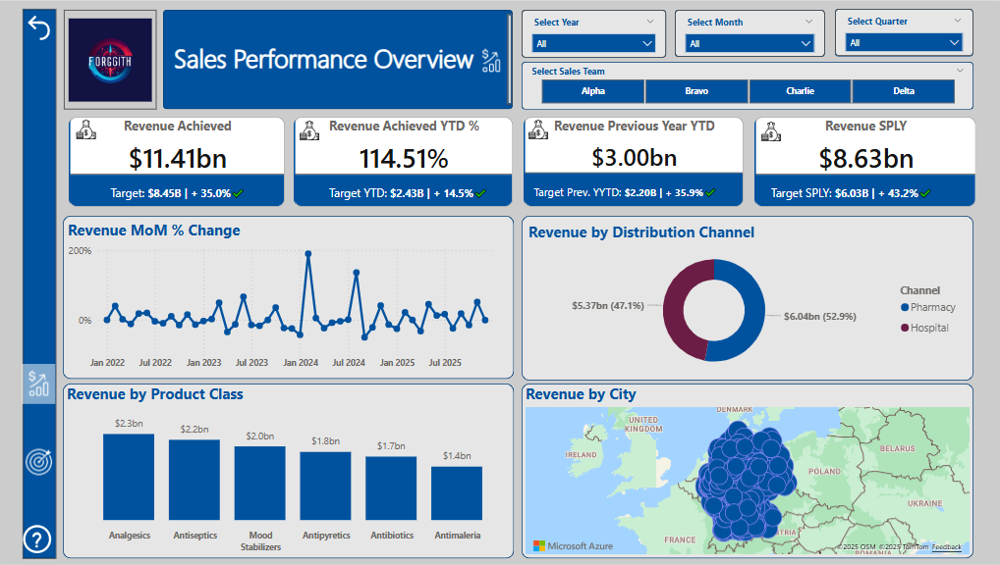

# 📊 Forggith BI Performance Tracker

# Project Background
Forggith, a German-based pharmaceutical company operating on a B2B model, manufactures drugs distributed to consumers through their network of distributors. The company possesses a substantial dataset encompassing sales, targets, product type, distribution channel, and distributor information spanning four years.

This project undertakes a thorough analysis and synthesis of their data to develop Power BI reports, as per their requirements, aimed at informing their strategic, tactical, and operational decision-making.

---

📌 Click to view Forggith’s reporting requirements

**Sales Performance Overview** (Sliced by Year, Month, Quarter, Team)
- Total Revenue
- YTD Total Revenue
- YTD Total Revenue (Previous Year)
- Same Period Last Year (SPLY) Revenue
- Total Target
- YTD Total Target
- Revenue Performance YTD vs Target YTD
- Month-on-Month Revenue Change
- Revenue by Location
- Revenue by Channel
- Revenue by Product Class

**Marketing Performance** (Sliced by Year, Quarter, Month, Product Category, Team)
- Revenue vs Target
- Volume vs Target
- Actual Revenue by Sales Rep
- Target Revenue Achievement by Sales Rep
- Actual Volume by Sales Rep
- Target Volume Achievement by Sales Rep
- Sales Team Revenue Achievement
- Product Revenue and Volume Achievement

---

Insights and recommendations are provided in the following key areas:

- **Sales Rep and Team Performance:** Evaluate the performance of individual sales reps and teams, focusing on achieved revenue, volume, and progress toward targets.

- **Product Class Contribution:** Analyze revenue and volume contributions from different product classes to identify key sales drivers and areas for strategic focus.

- **Distributor and Channels Contribution:** Analyze revenue and volume contributions by distributors and their respective channels across the years.

- **Revenue vs. Target Trends Over Time:** Track trends comparing actual revenue to targets over time, identifying performance patterns and seasonal variations for strategy adjustments.

---
## Data Structure and Modeling

From the datasets provided, the **Sales** fact table contains **213,598 rows** spanning four years of transactions (2022–2025). A **multi-fact table modeling approach** was used due to differences in granularity between the Sales and Target datasets.
Below is a snapshot of the data model created:

<!-- Replace with actual image path or URL -->

Why a multi-fact table approach was used

The Sales data is at the transaction level, while the Target data is aggregated by month, product, and sales rep. Directly linking these two would create granularity conflicts and incorrect aggregations. By modeling them as separate fact tables connected to shared dimensions, we maintain data integrity while enabling accurate comparisons and metrics.

Before building the model, several data transformation steps were carried out using **Power Query**, including:

- Cleaning and standardizing field entries  
- Merging the 2023–2025 sales data with the 2022 records  
- Unpivoting the yearly columns in the Target dataset to match the Sales structure  

These steps ensured consistency and compatibility across all datasets used in the reporting model.

View Power Query M scripts used for data cleaning

The cleaning process involved:
- Removing nulls and inconsistent entries  
- Normalizing column headers  
- Converting data types appropriately  
- Merging and appending sales tables across years  
- Unpivoting the target values across years into a single ‘Year’ column

You can find the complete M script in the Power BI file's `Transform Data` section.

Download the Excel file containing DAX measures

The Excel file contains all DAX measures used in the report, categorized by use case (Sales KPIs, Target Metrics, Team-level Rollups, etc.). This file can serve as a reference or be imported into another model for reuse.

📎 [DAX Measures File](#) *(Replace this link with actual file link)*

The final data model includes two fact tables — **Sales** and **Target** — connected to shared dimension tables:

- `DimProduct`  
- `DimEmployee`  
- `DimLocation`  
- `DimChannel`  
- A generated `Calendar` table for time intelligence

## 📊 Executive Summary

### Overview of Findings

Forggith Pharmaceuticals experienced steady revenue growth from 2022 through 2024, peaking at **$2.93 billion**, before encountering a slight contraction in 2025, with revenue declining to **$2.66 billion**. Despite this dip, each year recorded revenue above target, although **target achievement fell from 141.8% in 2022 to 109.7% in 2025**, signaling a deceleration in growth momentum.

During the same period, **sales volume declined year-over-year**, from **56,486 units in 2022 to 51,193 units in 2025**, alongside a drop in the number of active distributors from **14 to just 7**. This significant shrinking of the distribution footprint negatively impacted sales volume and revenue by 2025.

Below is the **Sales Performance Overview** page from the Power BI dashboard. Additional report pages with further breakdowns are included throughout this report.

**Click the image above to interact with the live Sales Overview Dashboard.**

### Sales Rep and Team Performance

Forggith Pharmaceuticals experienced steady revenue growth from 2022 through 2024, peaking at **$2.93 billion**, before encountering a slight contraction in 2025, with revenue declining to **$2.66 billion**. Despite this dip, each year recorded revenue above target, although **target achievement fell from 141.8% in 2022 to 109.7% in 2025**, signaling a deceleration in growth momentum.

During the same period, **sales volume declined year-over-year**, from **56,486 units in 2022 to 51,193 units in 2025**, alongside a drop in the number of active distributors from **14 to just 7**. This significant shrinking of the distribution footprint negatively impacted sales volume and revenue by 2025.

Below is the **Sales Performance Overview** page from the Power BI dashboard. Additional report pages with further breakdowns are included throughout this report.

### Product Class Performance

Forggith Pharmaceuticals experienced steady revenue growth from 2022 through 2024, peaking at **$2.93 billion**, before encountering a slight contraction in 2025, with revenue declining to **$2.66 billion**. Despite this dip, each year recorded revenue above target, although **target achievement fell from 141.8% in 2022 to 109.7% in 2025**, signaling a deceleration in growth momentum.

During the same period, **sales volume declined year-over-year**, from **56,486 units in 2022 to 51,193 units in 2025**, alongside a drop in the number of active distributors from **14 to just 7**. This significant shrinking of the distribution footprint negatively impacted sales volume and revenue by 2025.

Below is the **Sales Performance Overview** page from the Power BI dashboard. Additional report pages with further breakdowns are included throughout this report.

### Sales Team and Manager

Forggith Pharmaceuticals experienced steady revenue growth from 2022 through 2024, peaking at **$2.93 billion**, before encountering a slight contraction in 2025, with revenue declining to **$2.66 billion**. Despite this dip, each year recorded revenue above target, although **target achievement fell from 141.8% in 2022 to 109.7% in 2025**, signaling a deceleration in growth momentum.

During the same period, **sales volume declined year-over-year**, from **56,486 units in 2022 to 51,193 units in 2025**, alongside a drop in the number of active distributors from **14 to just 7**. This significant shrinking of the distribution footprint negatively impacted sales volume and revenue by 2025.

Below is the **Sales Performance Overview** page from the Power BI dashboard. Additional report pages with further breakdowns are included throughout this report.

### Distributors and Channels of Contributions

Forggith Pharmaceuticals experienced steady revenue growth from 2022 through 2024, peaking at **$2.93 billion**, before encountering a slight contraction in 2025, with revenue declining to **$2.66 billion**. Despite this dip, each year recorded revenue above target, although **target achievement fell from 141.8% in 2022 to 109.7% in 2025**, signaling a deceleration in growth momentum.

During the same period, **sales volume declined year-over-year**, from **56,486 units in 2022 to 51,193 units in 2025**, alongside a drop in the number of active distributors from **14 to just 7**. This significant shrinking of the distribution footprint negatively impacted sales volume and revenue by 2025.

Below is the **Sales Performance Overview** page from the Power BI dashboard. Additional report pages with further breakdowns are included throughout this report.

### Revenue vs. Target Trends Over Time

Forggith Pharmaceuticals experienced steady revenue growth from 2022 through 2024, peaking at **$2.93 billion**, before encountering a slight contraction in 2025, with revenue declining to **$2.66 billion**. Despite this dip, each year recorded revenue above target, although **target achievement fell from 141.8% in 2022 to 109.7% in 2025**, signaling a deceleration in growth momentum.

During the same period, **sales volume declined year-over-year**, from **56,486 units in 2022 to 51,193 units in 2025**, alongside a drop in the number of active distributors from **14 to just 7**. This significant shrinking of the distribution footprint negatively impacted sales volume and revenue by 2025.

Below is the **Sales Performance Overview** page from the Power BI dashboard. Additional report pages with further breakdowns are included throughout this report.

